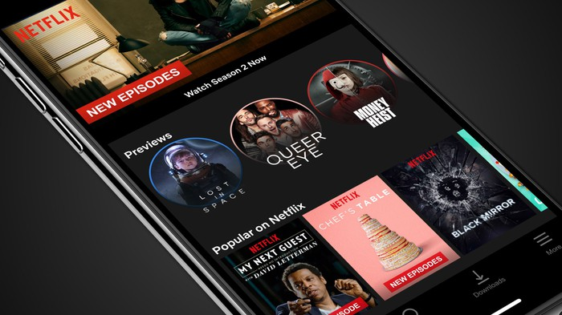

# Project 4: Algorithm implementation and evaluation: Collaborative Filtering



### [Project Description](doc/project4_desc.md)

Have you ever wondered why Netflix continues to dominate the movie and TV streaming industry since it's inception in the late 90's? Most people think that Netflix is able to keep most of it's competition at bay because of it's exceptionally large collection of original content which competitors cannot match. Indeed, this is true. However, we would like to also highlight Netflix's marketing strategy as another of it's major strengths. Netflix makes use of targeted marketing that makes full use of collaborative filtering techniques to satisfy clients by availing tailored content that match clients' tastes. This boasts customer loyalty and also easily entices new users; hence Netflix's continued dominance.

Term: Fall 2019

+ Team #
+ Projec title: Lorem ipsum dolor sit amet
+ Team members
	+ team member 1
	+ team member 2
	+ team member 3
	+ team member 4
	+ team member 5
+ Project summary: Lorem ipsum dolor sit amet, consectetur adipiscing elit, sed do eiusmod tempor incididunt ut labore et dolore magna aliqua. Ut enim ad minim veniam, quis nostrud exercitation ullamco laboris nisi ut aliquip ex ea commodo consequat. Duis aute irure dolor in reprehenderit in voluptate velit esse cillum dolore eu fugiat nulla pariatur. Excepteur sint occaecat cupidatat non proident, sunt in culpa qui officia deserunt mollit anim id est laborum.
	
**Contribution statement**: [default] All team members contributed equally in all stages of this project. All team members approve our work presented in this GitHub repository including this contributions statement. 

Following [suggestions](http://nicercode.github.io/blog/2013-04-05-projects/) by [RICH FITZJOHN](http://nicercode.github.io/about/#Team) (@richfitz). This folder is orgarnized as follows.

```
proj/
├── lib/
├── data/
├── doc/
├── figs/
└── output/
```

Please see each subfolder for a README file.
